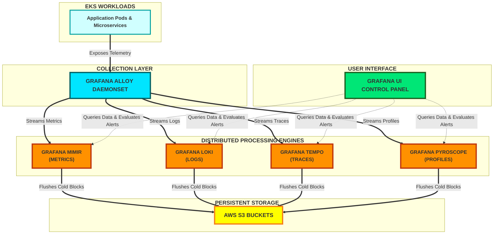

# 🚀 EKS Observability Platform Architecture (Grafana LGTM Stack)

This repository contains the declarative GitOps configurations to deploy a complete metrics, logging, tracing, continuous profiling, and alerting platform on Amazon EKS using the modern Grafana ecosystem.

---

## 🏗️ Architecture Components

### 1. 🚏 Data Collection & Shipping (The Single Agent)
Instead of running three different legacy agents (like Fluent Bit, Prometheus Agent, and Jaeger Agent), this platform utilizes a unified collection layer.

* **Grafana Alloy**
  * **Role:** Unified telemetry collector daemon.
  * **Why:** Replaces legacy components. Natively scrapes EKS cluster metrics, paths container file logs, intercepts application traces, and streams profile data into high-performance backends.

### 2. 📊 Metrics Storage
* **Grafana Mimir**
  * **Role:** Long-term, horizontally scalable time-series metrics storage engine.
  * **Why:** Drop-in replacement for standard Prometheus storage. Scales natively to handle millions of active metrics using cost-effective cloud object storage.
  * *Alternative:* **Amazon Managed Service for Prometheus (AMP)** can act as a drop-in replacement if fully-managed storage infrastructure is preferred over self-hosting.

### 3. 🪵 Log Aggregation
* **Grafana Loki**
  * **Role:** Highly efficient metadata-indexed log aggregation engine.
  * **Why:** Known as "Prometheus for logs." Avoids heavy full-text indexing by tracking only Kubernetes labels (e.g., `namespace`, `pod_name`, `container`). Keeps AWS S3 footprint low and enables rapid contextual log querying.

### 4. 🧭 Distributed Tracing
* **Grafana Tempo**
  * **Role:** High-scale, object-storage-backed distributed tracing engine.
  * **Why:** Ingests massive trace volumes without complex NoSQL database maintenance. Pairs trace IDs natively with logs to enable instant, single-click transitions from container errors to service trace bottlenecks.

### 5. 🔬 Continuous Profiling (The "Fourth Pillar")
* **Grafana Pyroscope**
  * **Role:** Continuous runtime application profiling engine.
  * **Why:** Monitors line-by-line CPU and memory consumption profiles across application runtimes. Helps identify exact code paths driving latency spikes or infrastructure over-provisioning.

### 6. 👁️ Visualization & Alerting Brain
* **Grafana (OSS / Enterprise)**
  * **Role:** Single pane of glass UI and centralized alerting management.
  * **Why:** Unifies operational dashboards by overlaying metrics, logs, traces, and execution profiles into cohesive diagnostic panels.
  * **Alerting:** Utilizes multi-dimensional **Grafana Alerting** pipelines to evaluate Mimir metrics or Loki query rates, routing active notifications directly to engineering endpoints (Slack, PagerDuty, Opsgenie, or AWS SNS).

---

## 🔄 Architectural Workflow on EKS




### 📋 Operational Workflow Steps
1. **Grafana Alloy** runs as a high-performance `DaemonSet` across all EKS worker nodes.
2. **Alloy** automatically discovers pod infrastructure endpoints to collect metrics, logs, traces, and profile signatures.
3. Telemetry pipelines stream data elements across the local network directly to **Mimir**, **Loki**, **Tempo**, and **Pyroscope** distributor layers.
4. Backends process real-time events in memory and commit long-term historical data blocks securely to isolated **AWS S3 buckets**.
5. Engineers log into the **Grafana UI** to manipulate dashboards, run ad-hoc calculations, and maintain system alert paths.


------------------------------
Here is the complete, decoupled production architecture values suite. It incorporates your Private Harbor Registry, AWS IRSA (IAM Roles for Service Accounts), Gateway API (kgateways), Grafana Alloy, and the continuous profiling engine, Grafana Pyroscope. [1, 2] 
Explicit dummy/placeholder labels are applied across all parameters to ensure safe replication inside your GitOps repository layout.
------------------------------
## Global Blueprint Placeholders

* Private Harbor Registry URL: ://example.com
* Private Project Repository Path: observability-mirror
* AWS S3 Standard Regional Endpoint: s3.us-east-1.amazonaws.com
* AWS IRSA Target Role ARN Matrix: arn:aws:iam::123456789012:role/eks-placeholder-<signal>-s3-role
* Gateway API Frontend Routing Hostname: ://example.com [2] 

------------------------------
```
├── argocd-apps/
│   ├── app-mimir.yaml
│   ├── app-loki.yaml
│   ├── app-tempo.yaml
│   ├── app-pyroscope.yaml
│   ├── app-grafana.yaml
│   └── app-alloy.yaml
└── helm-values/
    ├── values-mimir.yaml
    ├── values-loki.yaml
    ├── values-tempo.yaml
    ├── values-pyroscope.yaml
    ├── values-grafana.yaml
    └── values-alloy.yaml
```
------------------------------
```
helm repo add grafana-community https://grafana-community.github.io/helm-charts
helm repo add grafana https://grafana.github.io/helm-charts
helm repo update
kubectl create namespace monitoring
```

### Upstream Observability Components Matrix

| Component Name | Source Helm Repository | Helm Chart Name | Chart Version | Upstream Container Image | App / Image Tag |
| :--- | :--- | :--- | :--- | :--- | :--- |
| **Grafana Mimir** | `https://grafana-community.github.io/helm-charts` | `mimir-distributed` | `5.3.0` | `grafana/mimir` | `2.14.0` |
| **Grafana Loki** | `https://grafana-community.github.io/helm-charts` | `loki` | `6.6.0` | `grafana/loki` | `3.0.0` |
| **Grafana Tempo** | `https://grafana-community.github.io/helm-charts` | `tempo-distributed` | `1.15.0` | `grafana/tempo` | `2.4.1` |
| **Grafana Pyroscope** | `https://grafana-community.github.io/helm-charts` | `pyroscope` | `1.4.0` | `grafana/pyroscope` | `1.4.0` |
| **Grafana UI** | `https://grafana-community.github.io/helm-charts` | `grafana` | `8.3.0` | `grafana/grafana` | `11.0.0` |
| **Grafana Alloy** | `https://grafana.github.io/helm-charts` | `alloy` | `0.2.0` | `grafana/alloy` | `1.1.1` |

------------------------------

1. Grafana Mimir IAM Policy (mimir-s3-policy.json)

Mimir requires access to two distinct buckets: one for metrics time-series block chunks and one for Alertmanager state.
```
{
    "Version": "2012-10-17",
    "Statement": [
        {
            "Sid": "MimirStorageAccess",
            "Effect": "Allow",
            "Action": [
                "s3:ListBucket",
                "s3:PutObject",
                "s3:GetObject",
                "s3:DeleteObject"
            ],
            "Resource": [
                "arn:aws:s3:::eks-observability-mimir-blocks-placeholder",
                "arn:aws:s3:::eks-observability-mimir-blocks-placeholder/*",
                "arn:aws:s3:::eks-observability-mimir-alertmanager-placeholder",
                "arn:aws:s3:::eks-observability-mimir-alertmanager-placeholder/*"
            ]
        }
    ]
}
```
------------------------------
2. Grafana Loki IAM Policy (loki-s3-policy.json)
Loki requires read/write access to its structured log chunk storage bucket.
```{
    "Version": "2012-10-17",
    "Statement": [
        {
            "Sid": "LokiStorageAccess",
            "Effect": "Allow",
            "Action": [
                "s3:ListBucket",
                "s3:PutObject",
                "s3:GetObject",
                "s3:DeleteObject"
            ],
            "Resource": [
                "arn:aws:s3:::eks-observability-loki-chunks-placeholder",
                "arn:aws:s3:::eks-observability-loki-chunks-placeholder/*"
            ]
        }
    ]
}
```
------------------------------
3. Grafana Tempo IAM Policy (tempo-s3-policy.json)
Tempo requires read/write access to the bucket hosting distributed trace data blocks.
```
{
    "Version": "2012-10-17",
    "Statement": [
        {
            "Sid": "TempoStorageAccess",
            "Effect": "Allow",
            "Action": [
                "s3:ListBucket",
                "s3:PutObject",
                "s3:GetObject",
                "s3:DeleteObject"
            ],
            "Resource": [
                "arn:aws:s3:::eks-observability-tempo-traces-placeholder",
                "arn:aws:s3:::eks-observability-tempo-traces-placeholder/*"
            ]
        }
    ]
}
```
------------------------------
4. Grafana Pyroscope IAM Policy (pyroscope-s3-policy.json)Pyroscope requires read/write execution permissions for continuous application profiling data blocks.
```
{
    "Version": "2012-10-17",
    "Statement": [
        {
            "Sid": "PyroscopeStorageAccess",
            "Effect": "Allow",
            "Action": [
                "s3:ListBucket",
                "s3:PutObject",
                "s3:GetObject",
                "s3:DeleteObject"
            ],
            "Resource": [
                "arn:aws:s3:::eks-observability-pyroscope-profiles-placeholder",
                "arn:aws:s3:::eks-observability-pyroscope-profiles-placeholder/*"
            ]
        }
    ]
}
```
------------------------------
IAM Trust Relationship Configuration (OIDC Federated Mapping)

Each IAM role must possess a Trust Relationship document explicitly validating the EKS OIDC Issuer, the namespace `(monitoring)`, and the respective Kubernetes ServiceAccount name designated within the Helm charts.
------------------------------
Mimir Trust Policy (trust-mimir.json)
Matches the default distributed architecture service account: mimir-distributed.
```
{
  "Version": "2012-10-17",
  "Statement": [
    {
      "Effect": "Allow",
      "Principal": {
        "Federated": "arn:aws:iam::123456789012:oidc-provider/://amazonaws.com"
      },
      "Action": "sts:AssumeRoleWithWebIdentity",
      "Condition": {
        "StringEquals": {
          "://amazonaws.com:sub": "system:serviceaccount:monitoring:mimir-distributed",
          "://amazonaws.com:aud": "://amazonaws.com"
        }
      }
    }
  ]
}
```
------------------------------
Loki Trust Policy (trust-loki.json)
Matches the custom service account declared in the logging chart config: loki-distributed.
```
{
  "Version": "2012-10-17",
  "Statement": [
    {
      "Effect": "Allow",
      "Principal": {
        "Federated": "arn:aws:iam::123456789012:oidc-provider/://amazonaws.com"
      },
      "Action": "sts:AssumeRoleWithWebIdentity",
      "Condition": {
        "StringEquals": {
          "://amazonaws.com:sub": "system:serviceaccount:monitoring:loki-distributed",
          "://amazonaws.com:aud": "://amazonaws.com"
        }
      }
    }
  ]
}
```
------------------------------
Tempo Trust Policy (trust-tempo.json)
Matches the tracking architecture service account name structure: tempo-distributed.
```
{
  "Version": "2012-10-17",
  "Statement": [
    {
      "Effect": "Allow",
      "Principal": {
        "Federated": "arn:aws:iam::123456789012:oidc-provider/://amazonaws.com"
      },
      "Action": "sts:AssumeRoleWithWebIdentity",
      "Condition": {
        "StringEquals": {
          "://amazonaws.com:sub": "system:serviceaccount:monitoring:tempo-distributed",
          "://amazonaws.com:aud": "://amazonaws.com"
        }
      }
    }
  ]
}
```
------------------------------
Pyroscope Trust Policy (trust-pyroscope.json)
Matches the profiling deployment service account identifier: pyroscope.
```
{
  "Version": "2012-10-17",
  "Statement": [
    {
      "Effect": "Allow",
      "Principal": {
        "Federated": "arn:aws:iam::123456789012:oidc-provider/://amazonaws.com"
      },
      "Action": "sts:AssumeRoleWithWebIdentity",
      "Condition": {
        "StringEquals": {
          "://amazonaws.com:sub": "system:serviceaccount:monitoring:pyroscope",
          "://amazonaws.com:aud": "://amazonaws.com"
        }
      }
    }
  ]
}
```
------------------------------------

## 1. Grafana Mimir Distributed (values-mimir.yaml) [2] 

* Registry Source: grafana-community/mimir-distributed
```
global:
  image:
    registry: ://example.com
    repository: observability-mirror/mimir
    tag: 2.14.0

mimir:
  config:
    blocks_storage:
      backend: s3
      s3:
        endpoint: s3.us-east-1.amazonaws.com
        bucket_name: "eks-observability-mimir-blocks-placeholder"
        region: "us-east-1"
    alertmanager_storage:
      backend: s3
      s3:
        endpoint: s3.us-east-1.amazonaws.com
        bucket_name: "eks-observability-mimir-alertmanager-placeholder"
        region: "us-east-1"

minio:
  enabled: false

compactor:
  serviceAccount:
    annotations:
      eks.amazonaws.com/role-arn: "arn:aws:iam::123456789012:role/eks-placeholder-metrics-s3-role"
ingester:
  replicas: 3
  zoneAwarenessEnabled: true
  persistentVolume:
    size: 50Gi
    storageClass: gp3
  serviceAccount:
    annotations:
      eks.amazonaws.com/role-arn: "arn:aws:iam::123456789012:role/eks-placeholder-metrics-s3-role"
querier:
  replicas: 3
  serviceAccount:
    annotations:
      eks.amazonaws.com/role-arn: "arn:aws:iam::123456789012:role/eks-placeholder-metrics-s3-role"
store_gateway:
  replicas: 2
  serviceAccount:
    annotations:
      eks.amazonaws.com/role-arn: "arn:aws:iam::123456789012:role/eks-placeholder-metrics-s3-role"
distributor:
  replicas: 3
query_frontend:
  replicas: 2
```

------------------------------
# argocd-apps/app-mimir.yaml
```
apiVersion: argoproj.io/v1alpha1
kind: Application
metadata:
  name: mimir-distributed
  namespace: argocd
spec:
  project: default
  source:
    repoURL: https://example.com
    chart: mimir-distributed
    targetRevision: 5.3.0
    helm:
      valueFiles:
        - ../helm-values/values-mimir.yaml  # Path relative to source.path if defined, or root
  destination:
    server: https://default.svc
    namespace: monitoring
  syncPolicy:
    automated:
      prune: true
      selfHeal: true
```
------------------------------
## 2. Grafana Loki Distributed (values-loki.yaml) [2] 

* Registry Source: grafana-community/loki [3] 
```
global:
  image:
    registry: ://example.com
    repository: observability-mirror/loki
    tag: 3.0.0
deploymentMode: Distributed
loki:
  auth_enabled: false
  storage:
    type: s3
    s3:
      endpoint: s3.us-east-1.amazonaws.com
      bucket_name: "eks-observability-loki-chunks-placeholder"
      region: "us-east-1"
  limits_config:
    retention_period: 30d
serviceAccount:
  create: true
  name: loki-distributed
  annotations:
    eks.amazonaws.com/role-arn: "arn:aws:iam::123456789012:role/eks-placeholder-logs-s3-role"
ingester:
  replicas: 3
  persistence:
    size: 20Gi
    storageClass: gp3distributor:
  replicas: 3querier:
  replicas: 3queryFrontend:
  replicas: 2gateway:
  enabled: true
  deployment:
    image:
      registry: ://example.com
      repository: observability-mirror/nginx
```
------------------------------
# argocd-apps/app-loki.yaml
```
apiVersion: argoproj.io/v1alpha1
kind: Application
metadata:
  name: loki-distributed
  namespace: argocd
spec:
  project: default
  source:
    repoURL: https://example.com
    chart: loki
    targetRevision: 6.6.0
    helm:
      valueFiles:
        - ../helm-values/values-loki.yaml
  destination:
    server: https://default.svc
    namespace: monitoring
  syncPolicy:
    automated:
      prune: true
      selfHeal: true
```
------------------------------

## 3. Grafana Tempo Distributed (values-tempo.yaml) [2] 

* Registry Source: grafana-community/tempo-distributed
```
global:
  image:
    registry: ://example.com
    repository: observability-mirror/tempo
    tag: 2.4.1
meta:
  config:
    storage:
      trace:
        backend: s3
        s3:
          bucket_name: "eks-observability-tempo-traces-placeholder"
          region: "us-east-1"
serviceAccount:
  create: true
  annotations:
    eks.amazonaws.com/role-arn: "arn:aws:iam::123456789012:role/eks-placeholder-traces-s3-role"
distributor:
  replicas: 2ingester:
  replicas: 3
  persistence:
    size: 10Gi
    storageClass: gp3querier:
  replicas: 2queryFrontend:
  replicas: 2
```
------------------------------
# argocd-apps/app-tempo.yaml
```
apiVersion: argoproj.io/v1alpha1
kind: Application
metadata:
  name: tempo-distributed
  namespace: argocd
spec:
  project: default
  source:
    repoURL: https://example.com
    chart: tempo-distributed
    targetRevision: 1.15.0
    helm:
      valueFiles:
        - ../helm-values/values-tempo.yaml
  destination:
    server: https://default.svc
    namespace: monitoring
  syncPolicy:
    automated:
      prune: true
      selfHeal: true
```
------------------------------
## 4. Grafana Pyroscope Distributed (Continuous Profiling) (values-pyroscope.yaml) [2] 
Pyroscope is the fourth element, managing line-by-line profile storage on object layers. [4, 5] 

* Registry Source: grafana/pyroscope [6] 
```
global:
  image:
    registry: ://example.com
    repository: observability-mirror/pyroscope
    tag: 1.4.0
pyroscope:
  config:
    storage:
      backend: s3
      s3:
        endpoint: s3.us-east-1.amazonaws.com
        bucket_name: "eks-observability-pyroscope-profiles-placeholder"
        region: "us-east-1"
# Route execution permissions explicitly to profile bucketsserviceAccount:
  create: true
  annotations:
    eks.amazonaws.com/role-arn: "arn:aws:iam::123456789012:role/eks-placeholder-profiles-s3-role"
distributor:
  replicas: 2ingester:
  replicas: 3
  persistence:
    size: 15Gi
    storageClass: gp3querier:
  replicas: 2
```
------------------------------
# argocd-apps/app-pyroscope.yaml
```
apiVersion: argoproj.io/v1alpha1
kind: Application
metadata:
  name: pyroscope-distributed
  namespace: argocd
spec:
  project: default
  source:
    repoURL: https://example.com
    chart: pyroscope
    targetRevision: 1.4.0
    helm:
      valueFiles:
        - ../helm-values/values-pyroscope.yaml
  destination:
    server: https://default.svc
    namespace: monitoring
  syncPolicy:
    automated:
      prune: true
      selfHeal: true
```
------------------------------
## 5. Grafana Core Dashboard Interface (values-grafana.yaml) [2] 
Integrated directly with Mimir, Loki, Tempo, and Pyroscope database discovery strings. [2] 

* Registry Source: grafana-community/grafana [7] 
```
image:
  registry: ://example.com
  repository: observability-mirror/grafana
  tag: 11.0.0
persistence:
  enabled: true
  type: pvc
  storageClassName: "gp3"
  size: 30Gi
adminPassword: "YourHighlySecureProductionPasswordPlaceholder"
env:
  GF_AUTH_ANONYMOUS_ENABLED: "false"
datasources:
  datasources.yaml:
    apiVersion: 1
    datasources:
    - name: Prometheus-Mimir
      type: prometheus
      access: proxy
      url: http://cluster.local
      isDefault: true
    - name: Loki
      type: loki
      access: proxy
      url: http://cluster.local
    - name: Tempo
      type: tempo
      access: proxy
      url: http://cluster.local
    - name: Pyroscope
      type: phlare # Core plugin layout identifier matching downstream Pyroscope engines
      access: proxy
      url: http://cluster.local
```
------------------------------
# argocd-apps/app-grafana.yaml
```
apiVersion: argoproj.io/v1alpha1
kind: Application
metadata:
  name: grafana-ui
  namespace: argocd
spec:
  project: default
  source:
    repoURL: https://example.com
    chart: grafana
    targetRevision: 8.3.0
    helm:
      valueFiles:
        - ../helm-values/values-grafana.yaml
  destination:
    server: https://default.svc
    namespace: monitoring
  syncPolicy:
    automated:
      prune: true
      selfHeal: true
```
------------------------------

## 6. Grafana Alloy Deployment Agent (values-alloy.yaml) [8, 9] 
Alloy is installed from the core repository and runs as a node-level pipeline. It intercepts metrics, paths container file logs, manages traces, and captures system profile payloads to stream back into each microservice stack. [5, 10] 

* Registry Source: grafana/alloy
```
global:
  image:
    registry: ://example.com
    repository: observability-mirror/alloy
    tag: 1.1.1
alloy:
  type: daemonset
  clustering:
    enabled: true
  
  configMap:
    create: true
    content: |
      discovery.kubernetes "pods" {
        role = "pod"
      }
      
      // 1. METRICS CONTROL BLOCK
      prometheus.scrape "kubernetes_pods" {
        targets    = discovery.kubernetes.pods.targets
        forward_to = [prometheus.remote_write.mimir.receiver]
      }
      prometheus.remote_write "mimir" {
        endpoint {
          url = "http://cluster.local"
        }
      }

      // 2. LOG ROUTING PIPELINE
      local.file_match "container_logs" {
        path_targets = [{"__path__" = "/var/log/pods/*/*/*.log"}]
      }
      loki.source.file "pods" {
        targets    = local.file_match.container_logs.targets
        forward_to = [loki.write.loki_backend.receiver]
      }
      loki.write "loki_backend" {
        endpoint {
          url = "http://cluster.local"
        }
      }

      // 3. OPENTELEMETRY TRACING CONTEXT
      otelcol.receiver.otlp "otlp_receiver" {
        grpc { endpoint = "0.0.0.0:4317" }
        http { endpoint = "0.0.0.0:4318" }
        output {
          metrics = [otelcol.exporter.prometheus.mimir_otel.input]
          traces  = [otelcol.exporter.otlp.tempo_backend.input]
        }
      }
      otelcol.exporter.otlp "tempo_backend" {
        client {
          endpoint = "tempo-backend-distributor.monitoring.svc.cluster.local:4317"
          tls { insecure = true }
        }
      }
      otelcol.exporter.prometheus "mimir_otel" {
        forward_to = [prometheus.remote_write.mimir.receiver]
      }

      // 4. CONTINUOUS PROFILING INTERCEPTOR
      pyroscope.scrape "ebpf" {
        targets    = discovery.kubernetes.pods.targets
        forward_to = [pyroscope.write.pyroscope_backend.receiver]
      }
      pyroscope.write "pyroscope_backend" {
        endpoint {
          url = "http://cluster.local"
        }
      }
```
------------------------------
# argocd-apps/app-alloy.yaml
```
apiVersion: argoproj.io/v1alpha1
kind: Application
metadata:
  name: alloy-agent
  namespace: argocd
spec:
  project: default
  source:
    repoURL: https://example.com
    chart: alloy
    targetRevision: 0.2.0
    helm:
      valueFiles:
        - ../helm-values/values-alloy.yaml
  destination:
    server: https://default.svc
    namespace: monitoring
  syncPolicy:
    automated:
      prune: true
      selfHeal: true
```
------------------------------

## Step 7: Gateway API Live Routing Config (HTTPRoute-grafana.yaml)
Applied as a standalone manifest in your ArgoCD Git tracking repository to open external access safely. [11, 12] 
```
apiVersion: gateway.networking.k8s.io/v1kind: HTTPRoutemetadata:
  name: grafana-ui-route
  namespace: monitoring
  labels:
    argocd.argoproj.io/instance: grafana-uispec:
  parentRefs:
    - group: gateway.networking.k8s.io
      kind: Gateway
      name: external-kgateway-placeholder
      namespace: kube-system
  hostnames:
    - "://example.com"
  rules:
    - matches:
        - path:
            type: PathPrefix
            value: /
      backendRefs:
        - name: grafana-ui
          port: 80
```


[1] [https://artifacthub.io](https://artifacthub.io/packages/helm/grafana/alloy/0.1.0)

[2] [https://grafana.com](https://grafana.com/docs/loki/latest/setup/install/helm/configure-storage/)

[3] [https://grafana.com](https://grafana.com/docs/loki/latest/setup/install/helm/install-monolithic/)

[4] [https://github.com](https://github.com/grafana/pyroscope/blob/main/operations/pyroscope/helm/pyroscope/values.yaml)

[5] [https://grafana.com](https://grafana.com/docs/alloy/latest/introduction/)

[6] [https://github.com](https://github.com/grafana/helm-charts/issues/4087)

[7] [https://grafana.com](https://grafana.com/docs/grafana/latest/setup-grafana/installation/helm/)

[8] [https://artifacthub.io](https://artifacthub.io/packages/helm/grafana/alloy/0.1.0)

[9] [https://grafana.com](https://grafana.com/docs/alloy/latest/set-up/migrate/from-operator/)

[10] [https://jay75chauhan.medium.com](https://jay75chauhan.medium.com/kubernetes-observability-metrics-logs-and-traces-with-grafana-stack-d57882dbe639)

[11] [https://techdocs.broadcom.com](https://techdocs.broadcom.com/us/en/vmware-tanzu/bitnami-secure-images/bitnami-secure-images/services/bsi-app-doc/apps-charts-apisix-index.html)

[12] [https://scorpio.readthedocs.io](https://scorpio.readthedocs.io/en/latest/systemOverview.html)
